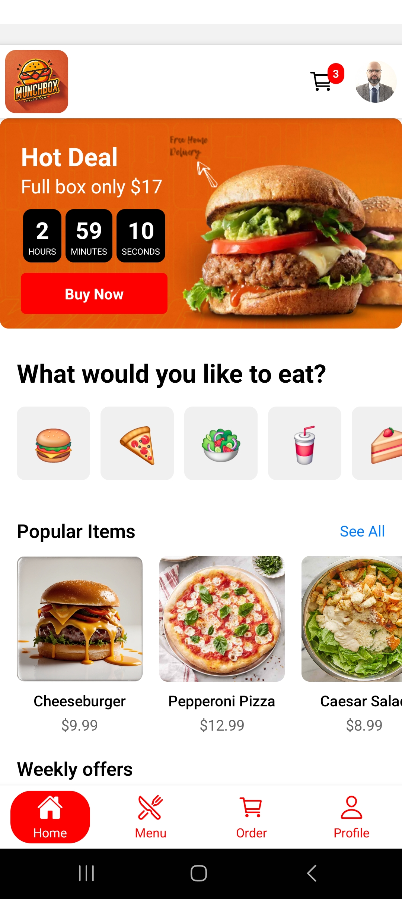
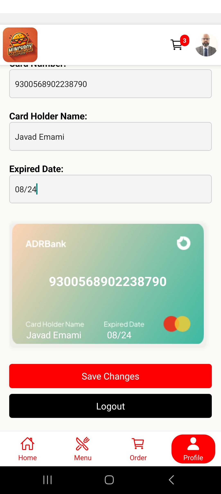
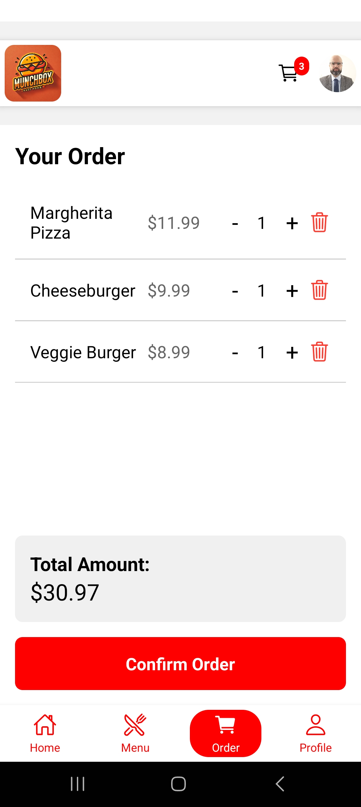
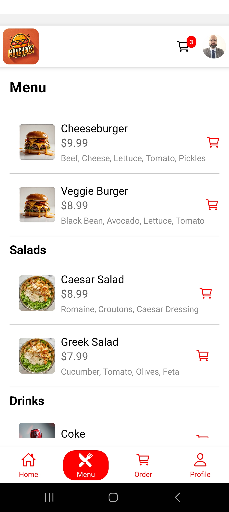
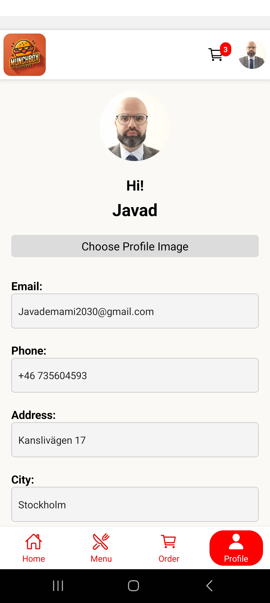

# Munch Box Project

## Overview

Munch Box is a React Native (Expo) mobile application designed for food ordering and delivery. It provides users with a seamless interface to browse the menu, customize their orders, and manage their profiles. The application aims to enhance the food ordering experience by integrating user-friendly features, including image uploads, cart management, and real-time notifications.

## Features

- **User Profile Management**: Users can create and update their profiles, including uploading a profile picture.
- **Menu Browsing**: A comprehensive menu with various food options is available for users to browse and select from.
- **Cart Management**: Users can add items to their cart and proceed to checkout.
- **Order Tracking**: Users receive real-time updates on their order status.

## Demo
Install APK file on your Android device to test it.
https://expo.dev/accounts/javademami/projects/fastfood-app/builds/89bef2b8-fe69-4cfd-9714-dfd5f3ed5b9c

## Screenshots

Here are some screenshots of the application to illustrate its functionality:

### Home Screen



### Profile



### Cart



### Menu



### Avatar




## Installation

To get started with the Munch Box project, clone the repository and install the necessary dependencies.

```bash
git clone https://github.com/javademami/fastfood.git
cd munch-box
npm install
```

## Usage

To run the application locally, use the following command:

```bash
npm start
```

This will start the development server and open the app in your default web browser.

## Contributing

We welcome contributions to the Munch Box project! If you'd like to contribute, please fork the repository and submit a pull request.

## License

This project is licensed under the MIT License.

---

Feel free to modify any part of this guide to better suit your project specifics! If you have more details or changes, just let me know.
